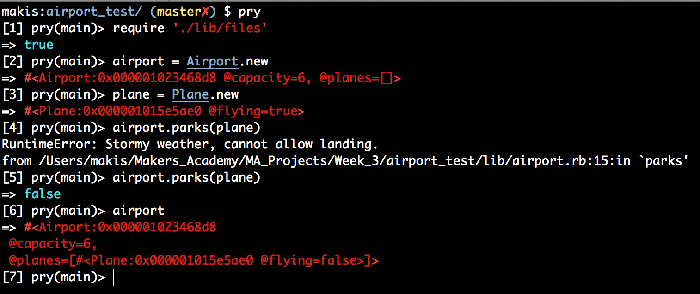

### Architect test, of week 3, controlling flow of planes at an airport.
---------

Basic functionality:

- Planes are flying by default
- Airport can be set with a certain capacity
- Weather generated randomly
- Planes can land if the weather is good
- Planes cannot land if the weather is stormy
- Planes cannot land if the aiport is full

How to use
----------

Clone the repository with
```
git clone git@github.com:Maikon/airport_test.git
```
Switch to it with
```
cd airport_test
```
Then open irb and require the files.rb file. The below shows the process (I use [Pry](http://pryrepl.org/) instead of IRB):




If you have rspec installed, you can also run the tests with:
```
rspec
```
